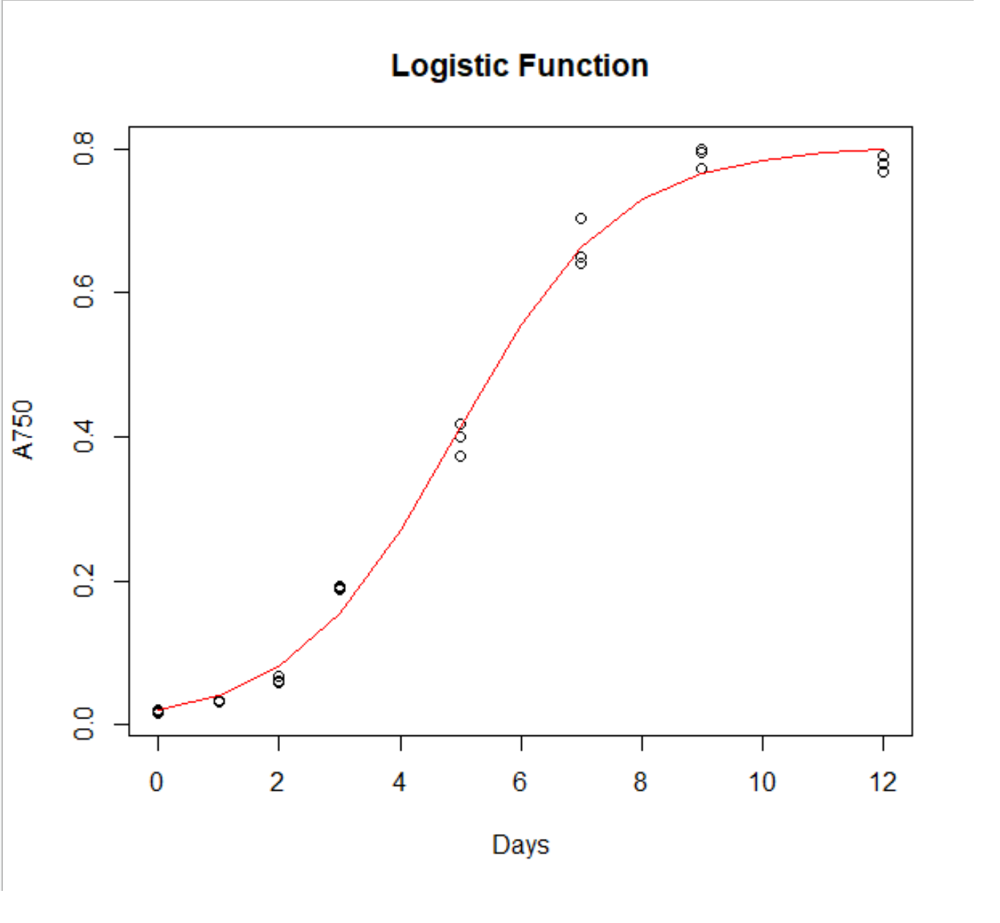

# logistic_curvefitting
Logistic curve fitting script for Henley lab. Uses R pacakge 'drc'.

This repo includes an example datafile from the Henley Lab at Oklahoma State University, 'henley.csv'. 

Example output:

